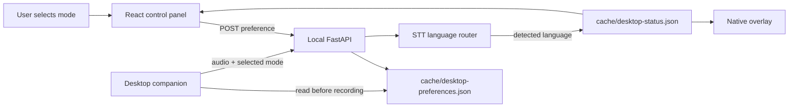

# Portable Desktop Release Design

**Date:** 2026-09-04
**Status:** Approved

## Overview

Make the bilingual Mongolian-English voice assistant easier to clone, test, run, and operate on Windows. The release covers documentation, GitHub Actions CI, portable configuration paths, one-click and optional auto-start packaging, and language controls/status visibility across the web control panel and native desktop companion.

## Goals

- Provide a complete Windows setup path in `README.md` and `docs/setup.md`.
- Run Python and frontend quality gates in GitHub Actions without a GPU.
- Remove default dependence on `D:/AI` while preserving explicit absolute-path support.
- Start the API, frontend, and desktop companion with one checked-in launcher.
- Offer reversible per-user Windows auto-start registration.
- Let users select `auto`, English, or Mongolian and see the latest detected language.
- Keep existing `mn` and `en` API clients compatible.

## Non-goals

- Packaging model weights into Git or a binary installer.
- Machine-wide registry changes or administrator-required installation.
- Replacing the existing local API, STT router, TTS engines, or hotkey implementation.
- Supporting macOS/Linux launchers in this change.
- Adding cloud hosting or external telemetry.

## Components

### Configuration

`AppConfig` will resolve relative paths from the repository root. Portable defaults will use repository-relative directories:

- `models/`
- `recordings/`
- `cache/`
- `logs/`
- `huggingface/`

`VOICE_ASSISTANT_ROOT` will override the base location for models and runtime data. Explicit absolute paths remain valid. Runtime directory creation will continue to happen during validated config loading.

### Shared desktop preferences

A small JSON file under `cache/` will store the selected desktop speech mode. A local API endpoint will validate and update the preference. The desktop companion will read the preference before each recording, so web-panel changes affect global `Win + Alt` dictation as well.

### Status propagation

The existing desktop status snapshot will gain selected-mode and detected-language fields. Automatic routing will update the detected-language field. The API will expose the additive fields through `/desktop/status`. Missing or malformed status data will continue to produce an offline-safe snapshot.

### Frontend

The React control panel will implement the approved **status plus selector** design:

- Three explicit modes: `AUTO`, `ENGLISH`, and `MONGOLIAN`.
- Persistent status indicator for API/desktop readiness.
- Latest detected language shown when automatic mode is active.
- Accessible labels, keyboard operation, and clear error states.
- Local persistence only for the UI preference; the shared desktop preference endpoint remains the source for the native companion.

The native overlay will display the selected mode and latest detected language and will continue linking to the control panel for explicit selection.

### Windows packaging

`scripts/start_all.cmd` will:

1. Resolve its own directory using `%~dp0`.
2. Validate the virtual environment and frontend dependencies.
3. Start the API, Vite UI, and desktop companion.
4. Preserve each service's output in the existing runtime log locations.

`scripts/install-autostart.ps1` will create a current-user Startup-folder shortcut to `start_all.cmd`. `scripts/uninstall-autostart.ps1` will remove only that shortcut. Both scripts will be idempotent and require no administrator privileges.

### CI

`.github/workflows/ci.yml` will run independent Python and frontend jobs:

- Python version matrix or pinned supported version, dependency cache, test suite, and compile check.
- Frontend npm cache, type-check/build, and Vitest tests.
- No model download or GPU requirement.
- Least-privilege workflow permissions.

## Data flow

## API changes

- Add a local preference read/update endpoint with strict `auto|en|mn` validation.
- Extend `/desktop/status` with additive language fields.
- Preserve existing `/stt`, `/tts`, `/chat`, `/health`, and `/voices` contracts.
- Return actionable `4xx` validation errors and `5xx` operational errors through existing error handling.

## Error handling

- Missing virtual environment, npm dependencies, or configuration produce launcher errors and non-zero exit status.
- Invalid language values are rejected rather than coerced.
- Missing preference/status files use safe defaults.
- Failed preference writes do not corrupt the previous file; use atomic replacement.
- Model/resource failures remain visible through API responses, desktop status, and logs.

## Testing strategy

### Python

- Relative and overridden path resolution using temporary directories.
- Preference store validation, persistence, atomic writes, and malformed-file fallback.
- API preference endpoint and additive status fields.
- Desktop companion reads selected language and sends it to STT.
- Existing full suite, compile checks, and no regressions to auto language routing.

### Frontend

- Selector renders all three modes.
- Selecting a mode persists and updates the API preference.
- Detected-language status renders correctly for automatic mode.
- Error/offline states remain accessible and actionable.
- Type-check, Vitest, and production build.

### Windows

- Launcher derives paths from its own location.
- Launcher dependency checks fail clearly.
- Autostart install/uninstall is idempotent and reversible.
- Manual smoke test: hold `Win + Alt`, speak English and Mongolian, release, and confirm correct pasted text.

## Security and privacy

- `.env` remains ignored; only `.env.example` is committed.
- No credentials are written to config, logs, or GitHub Actions output.
- API remains bound to loopback by default.
- Autostart registration is current-user only.
- CI permissions are read-only unless a specific action requires otherwise.

## Rollout and rollback

The changes ship as one commit on `main`. Rollback is a normal Git revert. Existing absolute-path configurations continue to work, so users can revert the YAML defaults without moving model files.

## Open questions

None. The user approved the design with portable Windows support, both launcher and optional auto-start packaging, and the status-plus-selector UI.
